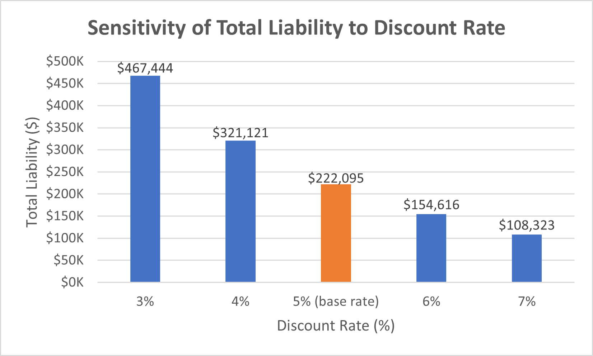

# Pension Liability Valuation Model

**Author:** Lavanya Khurana  
**Date:** October 2025  
**Purpose:** Actuarial Analysis Project

## Overview

This project calculates the present value of pension obligations for a 
defined benefit pension plan using life-contingent actuarial mathematics.

## Key Findings

- **Base Case Pension Liability:** $222,095
- **Most Sensitive To:** Discount rate (±$359,122 for 4% change)
- **Key Insight:** A 2% rate decrease more than doubles the liability

## Employee Profile

- Current Age: 35
- Retirement Age: 65
- Current Salary: $60,000
- Pension Formula: 1.5% × Years of Service × Final Salary

## Methodology

Calculated present value using:
1. Final salary projection (3% annual growth)
2. Annual pension benefit calculation
3. Life-contingent payment scheduling (mortality-adjusted)
4. Present value discounting (5% rate)
5. Comprehensive sensitivity analysis

## Files

- `Pension_Valuation.xlsx` - Complete Excel model
- `Pension_Liability_Valuation_Model_Report.pdf` - Full technical report

## Visualizations

### PV of Pension Benefits by Age

### Sensitivity Analysis - Discount Rate

### Sensitivity Analysis - Salary Growth

### Sensitivity Analysis - Retirement Age

### Sensitivity Analysis - Mortality Rate

### Sensitivity Analysis - Accrual Rate

### Tornado Chart 
s

## What I Learned

- Life contingencies and mortality applications
- Sensitivity analysis for financial risk
- Excel modeling with complex calculations
- Why pension plans are so expensive

## Limitations

- Simplified mortality rates (not SOA tables)
- Single employee (not portfolio)
- Deterministic (not stochastic)
- Educational purposes only

## References

- ASOP No. 4: Pension Obligations
- ASC 715: Pension Accounting
- SOA Resources

-------

Contact: [khurana.lavanya7@gmail.com]
